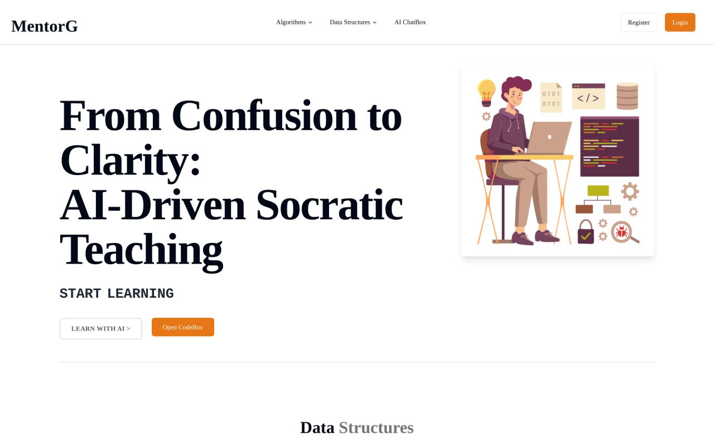
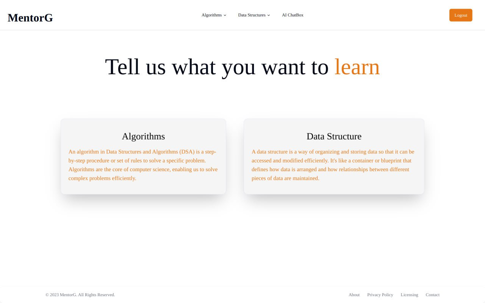
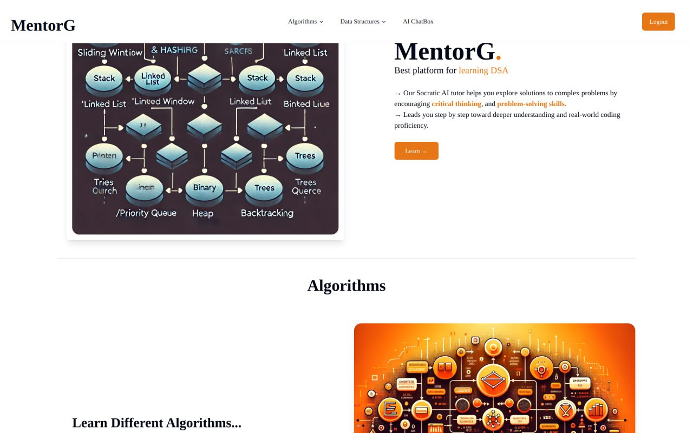
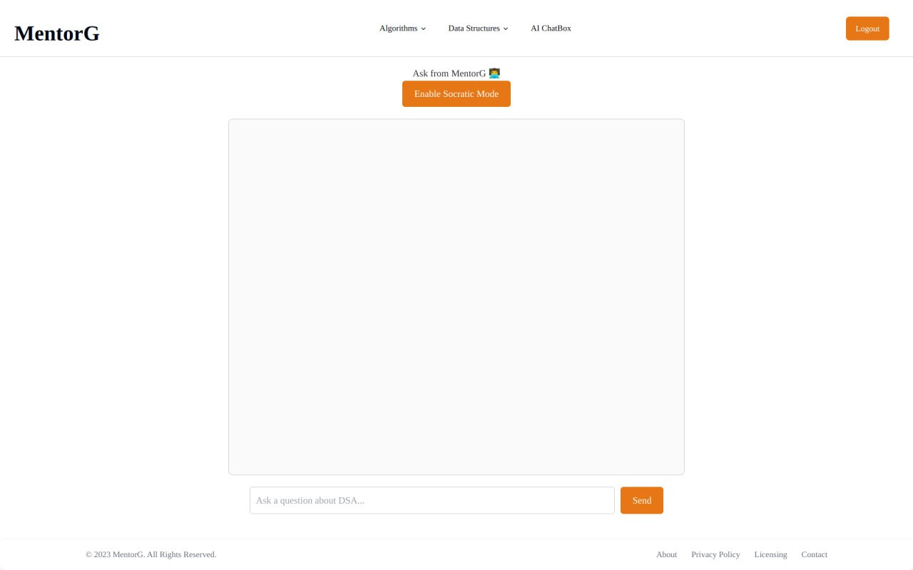
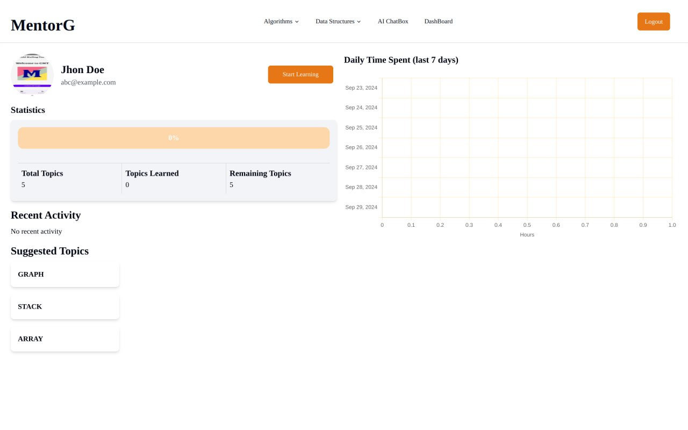
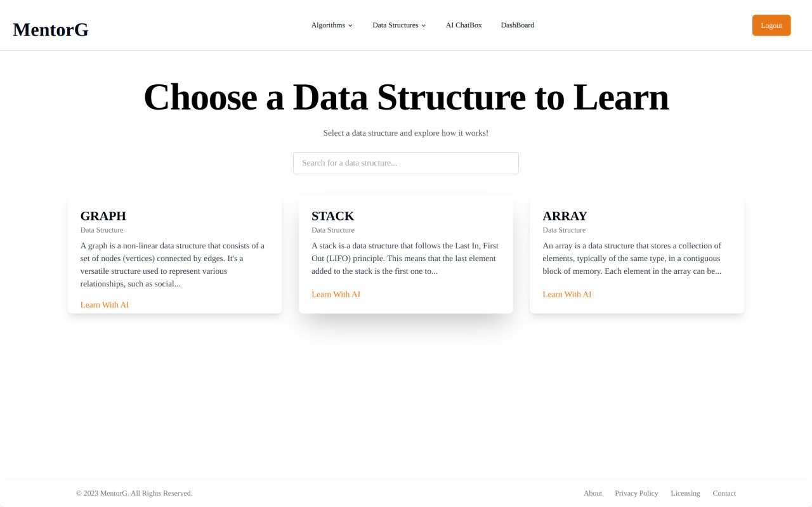

# MentorG  : Your AI-Powered Socratic DSA Learning Platform


Welcome to mentorG, where learning Data Structures and Algorithms (DSA) becomes a dialogue! Powered by AI, mentorG guides you through complex topics in a Socratic way—answering questions with questions to lead you to your own conclusions, encouraging deep understanding. With our AI Codebox, get real-time feedback on your code and improve your learning, while the AI Dashboard tracks your progress seamlessly.

## 🌟 Features

- 🧠 Socratic Learning: Engage in Socratic questioning for an interactive and deeper understanding of DSA concepts.
- 🤖 AI-Powered Codebox: Real-time analysis of your code, providing hints, optimizations, and best practices.
- 📊 AI-Driven Dashboard: Track your progress and receive personalized insights on your learning journey.
- 🛠 Seamless Integration: Built with cutting-edge technologies for a smooth and effective learning experience.

## 🚀 Tech Stack

- Frontend: [React](https://reactjs.org/)
- Database & Authentication: [Firebase](https://firebase.google.com/)
- Styling: [Tailwind CSS](https://tailwindcss.com/)
  
## ⚙️ Installation & Setup

### Prerequisites

Make sure you have the following installed:

- Node.js (>=14.x)
- Firebase CLI (for backend setup)

### Clone the Repository

```bash
git clone https://github.com/sparshsinghal885/MentorG.git
cd mentorG/frontened/
```

### Install Dependencies

npm install

### Firebase Setup

Make sure to configure Firebase by running:

```bash
npm i firebase
```

Then link the project to your Firebase account.

### Start the Development Server

```bash
npm run dev
```

Visit http://localhost:5173 in your browser.

## 📈 How It Works

1. Sign up and create your profile.
2. Explore the Socratic Lessons in DSA, where our AI system will challenge you with the right questions.
3. Write your code in the AI Codebox and get instant feedback on its efficiency, complexity, and more.
4. Track your learning journey on the Dashboard, which evolves based on your progress.


## 📸 Screenshots

<table>
  <tr>
    <td></td>
    <td></td>
  </tr>
  <tr>
    <td></td>
    <td></td>
  </tr>
  <tr>
    <td></td>
    <td></td>
  </tr>
</table>

Made with 💙 by Sparsh Singhal